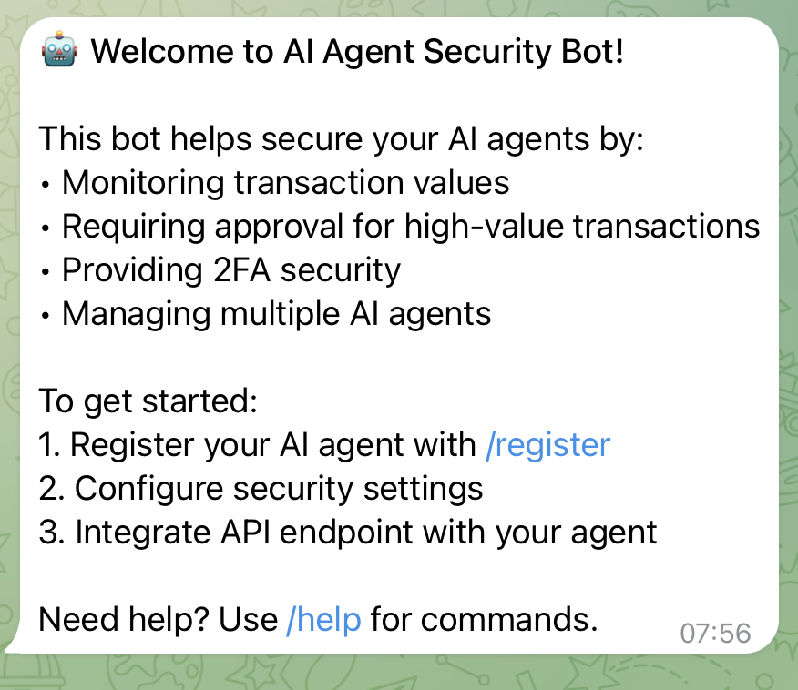

# 🛡️ hAUTH

## Secure Human Authentication Layer for Autonomous AI Agents

## At a Glance 🔍

AI Agent hAUTH is a security middleware solution that provides human oversight for autonomous AI agents operating on blockchain networks. In an era where AI agents are increasingly handling complex DeFi operations, the need for human verification on critical transactions has become paramount.

**Why hAUTH?**

- 🤖 AI agents can experience hallucinations or unreliable behaviors
- 💰 Cryptocurrency operations involve real financial risks
- 🔐 Human verification adds a crucial security layer
- ⚡ Seamless integration with existing AI agents

**Core Value Proposition:**
"Bringing human intelligence to autonomous AI operations without sacrificing efficiency"



---

## Table of Contents

### 1. Foundation

- [Overview](#overview)
  - [Key Features](#key-features)
  - [Architecture](#architecture)

### 2. Technical Infrastructure

- [Smart Contract Infrastructure](#smart-contract-infrastructure)
  - [Contract Details](#contract-details)
  - [Deployment Addresses](#deployment-addresses)
  - [Key Structures](#key-structures)
  - [Core Functions](#core-functions)

### 3. Interface & Operations

- [hAUTH Bot (Telegram Interface)](#hauth-bot-telegram-interface)
  - [Commands](#commands)
  - [Security Features](#security-features)
  - [Transaction Approval Flow](#transaction-approval-flow)
  - [Two-Factor Authentication](#two-factor-authentication)
  - [Threshold Management](#threshold-management)

### 4. Implementation

- [Python AI Agent Implementation](#python-ai-agent-implementation)
  - [Features](#features)
  - [Commands](#agent-commands)
  - [Operation Types](#operation-types)
  - [Integration Example](#integration-example)
- [Coinbase CDP AgentKit Implementation](#coinbase-cdp-agentkit-implementation)
  - [Overview](#overview-1)
  - [Why CDP AgentKit?](#why-cdp-agentkit)
  - [AgentKit Features](#agentkit-features)

### 5. Integration & Security

- [API Endpoints](#api-endpoints)
- [Security Considerations](#security-considerations)
- [Development Setup](#development-setup)
- [Future Improvements](#future-improvements)

---

## Overview

AI Agent hAUTH provides a secure human authentication layer for autonomous AI agents operating with blockchain operations(e.g. DeFi). It addresses the critical challenge of ensuring human oversight over high-value or high-risk transactions initiated by AI agents, preventing potential issues arising from hallucinations or unreliable AI behaviors.

### Key Features

- **Transaction Monitoring**: Configurable thresholds for transaction values and gas costs
- **Human Authentication**: Telegram-based approval system for transactions exceeding thresholds
- **Two-Factor Authentication (2FA)**: Optional additional security layer using Google Authenticator
- **Multi-Chain Support**: Configurations stored on-chain for various networks
- **Multi-Agent Management**: Support for multiple AI agents under a single user
- **Fusion+ Integration**: Special handling for cross-chain swaps

### Architecture

The system consists of three main components:

1. **Smart Contracts**: On-chain storage of agent configurations and thresholds
2. **Authentication Server**: Node.js server handling approval requests and Telegram integration
3. **AI Agent SDK**: Python implementation for AI agents to integrate with the authentication system

## 

## Smart Contract Infrastructure

### Contract Details

The `AgentsRegistry` contract serves as the backbone of the system, storing and managing AI agent configurations on-chain.

#### Deployment Addresses

- 🟢 Base Sepolia: [`0xf77f3E6ed19DAFe90f90c3C1609207902C7414f9`](https://sepolia.basescan.org/address/0xf77f3E6ed19DAFe90f90c3C1609207902C7414f9)
- 🟢 Celo (Alfajores): [`0x438751D3309247De00185DEDb5874Dbb99aD7c3C`](https://alfajores.celoscan.io/address/0x438751D3309247De00185DEDb5874Dbb99aD7c3C)
- 🟢 Polygon (Amoy): [`0xfF35E64807479DB10F6b6462796f8c1d567ba888`](https://amoy.polygonscan.com/address/0xfF35E64807479DB10F6b6462796f8c1d567ba888)
- 🟢 Neon EVM (Devnet): [`0x438751D3309247De00185DEDb5874Dbb99aD7c3C`](https://devnet.neonscan.org/address/0x438751D3309247De00185DEDb5874Dbb99aD7c3C)
- 🟢 Linea (Sepolia): [`0xfF35E64807479DB10F6b6462796f8c1d567ba888`](https://sepolia.lineascan.build/address/0xfF35E64807479DB10F6b6462796f8c1d567ba888)
- 🟢 Morph (Holesky): [`0x438751D3309247De00185DEDb5874Dbb99aD7c3C`](https://explorer-holesky.morphl2.io/address/0x438751D3309247De00185DEDb5874Dbb99aD7c3C)
- 🟢 Rome (Testnet): [`0x438751D3309247De00185DEDb5874Dbb99aD7c3C`](https://rome.testnet.romeprotocol.xyz:1000/address/0x438751D3309247De00185DEDb5874Dbb99aD7c3C)
- 🟢 Scroll (Sepolia): [`0x438751D3309247De00185DEDb5874Dbb99aD7c3C`](https://sepolia.scrollscan.com/address/0x438751D3309247De00185DEDb5874Dbb99aD7c3C)
- 🟢 Flow (Testnet): [`0x438751D3309247De00185DEDb5874Dbb99aD7c3C`](https://evm-testnet.flowscan.io/address/0x438751D3309247De00185DEDb5874Dbb99aD7c3C)

Legend:

- 🟢 Deployed and operational

#### Key Structures

```solidity
struct AgentConfig {
    uint96 valueThreshold;    // Value threshold in Wei
    uint96 gasThreshold;      // Gas threshold in Wei
    bool isSetup2FA;         // 2FA status
    bool isActive;           // Agent status
    string metadata;         // Telegram chat ID
    address owner;           // Agent owner address
}
```

#### Core Functions

- `registerAgent`: Register new AI agent with initial configurations
- `updateThresholds`: Modify value and gas thresholds
- `toggle2FA`: Enable/disable 2FA for an agent
- `checkTransactionApproval`: Verify if a transaction needs approval

---

## hAUTH Bot (Telegram Interface)

The Telegram bot serves as the primary interface for managing AI agents and handling transaction approvals.

### Commands

- `/start`: Initialize bot and get welcome message
- `/register`: Register a new AI agent
- `/settings`: Configure agent security settings
- `/agents`: View list of registered agents
- `/help`: Display available commands


### Security Features

#### Transaction Approval Flow

1. AI agent submits transaction for approval
2. Bot checks thresholds and 2FA requirements
3. Sends approval request to authorized Telegram chat
4. Processes user response (approve/reject)
5. Returns result to AI agent

#### Two-Factor Authentication

- Setup using Google Authenticator
- QR code or manual key entry
- Required for high-value transactions when enabled
- Can be toggled per agent

#### Threshold Management

- Value threshold (ETH/native token)
- Gas threshold (Gwei)
- Configurable per agent
- Real-time monitoring

---

## Python AI Agent Implementation

### Overview

The Python implementation demonstrates how to integrate AI agents with the hAUTH system. The AI agent runs inside a Trusted Execution Environment (TEE) powered by Phala Network, ensuring secure and verifiable execution of the agent's operations. This implementation leverages Phala's TEE infrastructure to guarantee that the AI agent's operations are tamper-proof and its credentials remain secure from external access.


### Features

- OpenAI GPT-4 integration
- Multi-chain support (Base, Base Sepolia)
- Transaction history tracking
- Colorized console interface
- Fusion+ cross-chain swaps
- **Secure Execution**: Runs in Phala Network's TEE environment
- **Verifiable Computation**: All operations are verifiable through TEE attestation
- **Tamper-proof Credentials**: Private keys and sensitive data are protected within the TEE

### Commands

```
Available Commands:
├─ balance - Check your balance
├─ send X ETH to ADDRESS - Send ETH to an address
├─ fusion X USDC - Swap directly from on different chains(e.g. Base to Arbitrum) without bridging using 1inch Fusion+
├─ help - Show help message
├─ history - Show transaction history
└─ exit - Exit program
```

### Operation Types

1. **Transfer Operations**

   - ETH transfers with threshold checking
   - Automatic gas estimation
   - Human approval integration

2. **Balance Operations**

   - Check account balances
   - Support for any address lookup

3. **Fusion Operations**
   - Swapping via 1inch Fusion+
   - Special threshold handling
   - Progress tracking

### Integration Example

```python
agent = BlockchainAgent()
agent.set_network('base-sepolia')
response = agent.process_message("send 1 ETH to 0x...")
```

---

## API Endpoints

### Transaction Approval

```
POST /api/request-approval
{
    "agentAddress": "0x...",
    "transaction": {
        "to": "0x...",
        "value": "1000000000000000000",
        "gasPrice": "50000000000"
    }
}
```

### Fusion+ Approval

```
POST /api/request-fusion-approval
{
    "agentAddress": "0x...",
    "amount": "1000",
    "type": "fusion"
}
```

---

## Security Considerations

### Threshold Management

- Default value threshold: 0.00001 ETH
- Default gas threshold: 50 Gwei
- Configurable per network and agent
- Real-time price monitoring

### Authentication Layers

1. Telegram chat verification
2. Optional 2FA via Google Authenticator
3. On-chain ownership verification
4. Transaction signing validation

### Best Practices

- Enable 2FA for all production agents
- Set appropriate thresholds based on operation type
- Regular monitoring of transaction history
- Keep Telegram bot token secure
- Monitor gas prices for network conditions

---

## Coinbase CDP AgentKit Implementation

### Overview

In addition to our custom Python implementation, we leverage Coinbase's CDP AgentKit as a foundation for building secure AI agents. This implementation also runs within Phala Network's TEE environment, ensuring secure and verifiable execution.

### Why CDP AgentKit?

- **Model Flexibility**: Supports multiple LLM providers (OpenAI, Claude, Llama)
- **CDP SDK Integration**: Native support for on-chain operations
- **Extensible Architecture**: Template structure for custom functionality
- **LangChain Compatibility**: Integrates with existing LangChain tools
- **Security Integration**: Seamlessly works with hAUTH's security layer for high-risk transactions

### AgentKit Features

The CDP AgentKit integration provides:

- **On-chain Operations**: Direct interaction with blockchain operations
- **Transaction Management**: Handles transfers, swaps, and contract deployments
- **Risk Management**: Integration with hAUTH for transaction verification
- **TEE Security**: Runs in Phala's trusted execution environment
- **Base Network Support**: Optimized for Base network operations

## Development Setup

### Prerequisites

- Node.js 18+
- Python 3.8+
- OpenAI API key
- Telegram Bot Token
- Ethereum wallet private key
- Alchemy API key

### Environment Variables

```
BOT_TOKEN=your_telegram_bot_token
OPENAI_API_KEY=your_openai_api_key
PRIVATE_KEY=your_ethereum_private_key
ALCHEMY_API_KEY=your_alchemy_api_key
```

### Installation

Follow these steps to set up the complete hAUTH system:

#### 1. Prerequisites

- [Foundry](https://book.getfoundry.sh/getting-started/installation) for smart contract development
- [Node.js](https://nodejs.org/) (v16 or higher)
- [Telegram Account](https://telegram.org/) for bot setup
- [Alchemy Account](https://www.alchemy.com/) for RPC access

#### 2. Smart Contract Setup

```bash
# Clone the repository
git clone https://github.com/yourusername/hauth
cd hauth

# Navigate to contracts directory
cd storage

# Install dependencies
forge install

# Build contracts
forge build

# Run tests
forge test

# Deploy contracts (repeat for each network)
forge script script/AgentsRegistry.s.sol:AgentsRegistryScript --rpc-url $RPC_URL --broadcast
```

#### 3. Environment Setup

1. Copy the example environment file from root directory:

```bash
cp .env.example .env
```

2. Fill in the required environment variables:

```bash
# Telegram Bot Token (from BotFather)
BOT_TOKEN=your_bot_token_here

# Ethereum Wallet Private Key
PRIVATE_KEY=your_private_key_here

# Alchemy API Key
ALCHEMY_API_KEY=your_alchemy_api_key_here
```

#### 4. Update Registry Address

1. Navigate to `hauth/constants.js`
2. Update the `REGISTRY_ADDRESS` constant with your deployed contract address

#### 5. Run the bot

```bash
# From project root directory
node hauth/index.js
```

#### 6. Run AI Agent

Test AI Agent:

```bash
# Run the test agent
node ai-agents/testAgent.js
```

Python AI Agent:

1. Fill additional environment variables:

```bash
# 1inch and OpenAI API keys
INCH_API_KEY=your_1inch_api_key
PRIVATE_KEY=your_private_key
BASE_URL=https://mainnet.base.org
OPENAI_API_KEY=your_openai_api_key
BASE_SEPOLIA_URL=https://base-sepolia-rpc.publicnode.com
```

2. Start the 1inch Fusion service:

```bash
# Run 1inch service
node 1inchService.js
```

3. Run the Python AI agent:

```bash
# Start the Python agent

python3 main.py
```

## Future Improvements

- Co-Owned AIs
- Advanced dashboard for easy Agent configuration and activity monitoring
- Diversified mobile app integrations
- In app integrated LLM AI Agent
- Generelized plugin for diverse AI Agents
